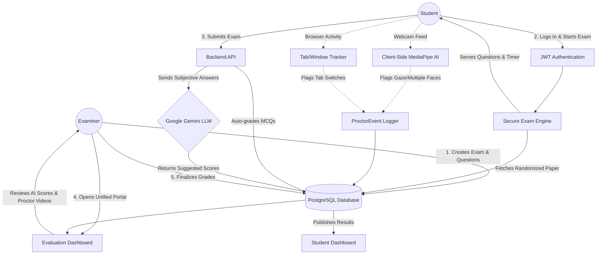

```mermaid
graph TD
    E((Examiner))
    S((Student))
    
    E -->|1. Creates Exam & Questions| DB[(PostgreSQL Database)]
    
    S -->|2. Logs In & Starts Exam| Auth[JWT Authentication]
    Auth --> ExamEngine[Secure Exam Engine]
    
    ExamEngine -->|Fetches Randomized Paper| DB
    ExamEngine -->|Serves Questions & Timer| S
    
    S -.->|Webcam Feed| AI[Client-Side MediaPipe AI]
    S -.->|Browser Activity| Tracker[Tab/Window Tracker]
    AI -.->|Flags Gaze/Multiple Faces| Log[ProctorEvent Logger]
    Tracker -.->|Flags Tab Switches| Log
    Log --> DB
    
    S -->|3. Submits Exam| Backend[Backend API]
    Backend -->|Auto-grades MCQs| DB
    Backend -->|Sends Subjective Answers| Gemini{Google Gemini LLM}
    Gemini -->|Returns Suggested Scores| DB
    
    E -->|4. Opens Unified Portal| Review[Evaluation Dashboard]
    DB --> Review
    Review -->|Reviews AI Scores & Proctor Videos| E
    E -->|5. Finalizes Grades| DB
    
    DB -->|Publishes Results| StudentDash[Student Dashboard]
```
